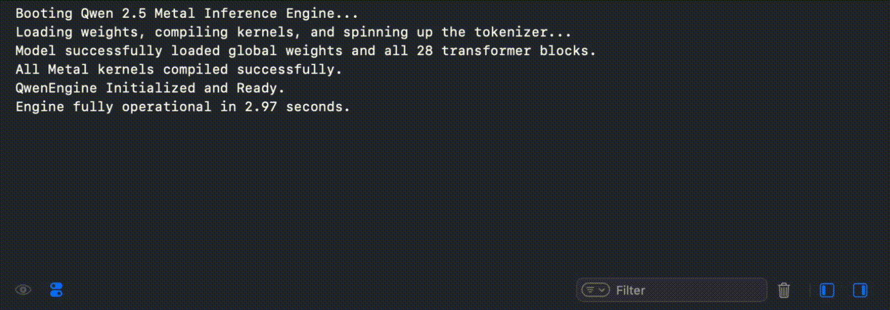

# QwenInferenceEngine
A custom-built, highly optimized Large Language Model inference engine for Apple Silicon, written entirely from scratch in Swift and Metal. This project bypasses standard heavyweight wrappers to provide a raw, bare-metal implementation of the Qwen2.5-1.5B-Instruct architecture. It features custom 4-bit quantization, stateful byte-pair tokenization, and dynamic probabilistic sampling for real-time conversational AI.

## Core Architecture & Specs
- **Supported Model:** Qwen2.5-1.5B-Instruct (1.54 Billion Parameters).
- **Transformer Dimensions:** 28 Layers, 1536 hidden dimension, 8960 intermediate size.
- **Attention:** Grouped Query Attention (GQA) with 12 Query heads and 2 KV heads.
- **Core Math:** RoPE (Rotary Positional Embeddings), SwiGLU activations, RMSNorm, and Attention QKV biases.
- **Memory Footprint:** Efficient, 4-bit symmetric block quantization (block size 32) for Attention and MLP projection matrices.
- **Logit Precision:** Pure FP16 execution for the final LM Head to perfectly preserve vocabulary probabilities.

## Key Engine Features
- **Apple Silicon Threadgroup Optimization:** Custom Metal compute kernels architected specifically to safely synchronize within Apple's strict 1024 hardware threadgroup limits.
- **Fused GEMV Pipelines:** Vector math pipelines feature fused bias addition and scale decompression in a single GPU dispatch.
- **Rolling KV Cache:** Native FP16 Key-Value cache memory-mapped directly in Swift for high-speed, autoregressive sequence generation.
- **Dynamic Top-P Sampling:** Replaces naive greedy decoding with a mathematically stable Softmax, Temperature scaling, and Top-P (Nucleus) sampler for natural, creative text generation.
- **Advanced Detokenizer:** A stateful, streaming byte-buffer detokenizer that safely parses complex multi-byte UTF-8 Unicode characters (like emojis) without string corruption, alongside manual ChatML tag (<|im_start|>, <|im_end|>) parsing.
